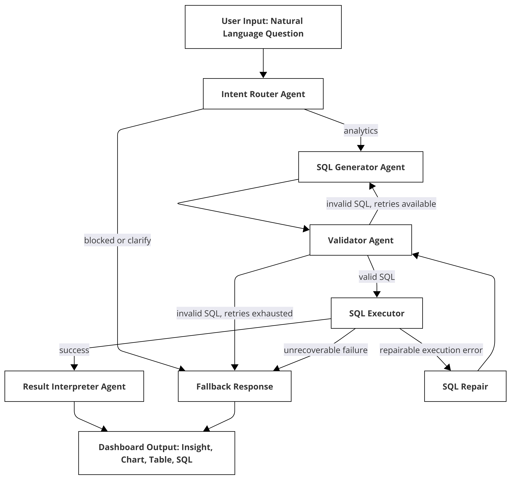

# MediCore NL2SQL

MediCore NL2SQL is a multi-agent hospital analytics platform that converts natural language questions into safe SQL, executes them against the MediCore dataset, and returns structured tables, charts, and plain-English insights through a Streamlit dashboard.

The project is built around a LangGraph workflow with explicit routing, SQL generation, validation, execution, repair, interpretation, observability, and multi-turn memory.




## Highlights

- Multi-agent LangGraph pipeline for NL2SQL analytics.
- Intent routing for analytics, clarification, and blocked requests.
- Schema-aware SQL generation using the live MediCore database schema.
- Deterministic SQL validation with safety, schema, and syntax checks.
- Read-only SQL execution with defense-in-depth safeguards.
- Execution repair loop for runtime SQL errors and empty result checks.
- Result interpretation with natural language summaries and Plotly chart specs.
- Multi-turn conversation memory for follow-up questions.
- Streamlit dashboard with ad hoc questions and prebuilt hospital analytics panels.
- Local JSON tracing with optional LangFuse observability.
- Docker and Docker Compose deployment support.
- Offline unit tests for deterministic pipeline components.

## Architecture

The main request path is:

```text
User input
  -> Conversation memory / contextualizer
  -> Intent router
  -> SQL generator
  -> SQL validator
  -> SQL executor
  -> Result interpreter
  -> Dashboard output
```

Failure and retry paths are intentionally bounded:

```text
Validation failure
  -> SQL generator retry
  -> validator

Repairable execution issue
  -> SQL repair
  -> validator
  -> executor

Blocked or ambiguous intent
  -> fallback response
```

Execution repair is used when SQL passed validation but execution produced a repairable problem, such as an ambiguous column, invalid column at runtime, aggregate misuse, datatype mismatch, or an empty result that may be caused by overly restrictive filters.

## Project Structure

```text
medicore-nl2sql/
|-- agents/
|   |-- router_agent.py
|   |-- contextualizer_agent.py
|   |-- sql_generator.py
|   |-- validator_agent.py
|   |-- result_interpreter.py
|   |-- fallback_agent.py
|   `-- base_agent.py
|-- core/
|   |-- graph.py
|   |-- state.py
|   |-- executor.py
|   |-- memory.py
|   |-- schema_loader.py
|   |-- tracer.py
|   `-- db_setup.py
|-- dashboard/
|   |-- app.py
|   `-- chart_renderer.py
|-- config/
|   `-- params.yaml
|-- docs/
|   `-- diagram.png
|-- tests/
|   `-- test_pipeline.py
|-- Dockerfile
|-- docker-compose.yml
|-- requirements.txt
|-- medicore_data.sql
`-- README.md
```

## Quick Start

### 1. Clone the repository

```bash
git clone https://github.com/AhamedShaa/medicore-nl2sql.git
cd medicore-nl2sql
```

### 2. Create and activate a virtual environment

Windows:

```bash
python -m venv venv
venv\Scripts\activate
```

macOS/Linux:

```bash
python -m venv venv
source venv/bin/activate
```

### 3. Install dependencies

```bash
pip install -r requirements.txt
```

### 4. Configure environment variables

Copy the example file and add your API keys:

```bash
cp .env.example .env
```

Required:

```text
OPENROUTER_API_KEY=your_openrouter_api_key_here
```

Optional:

```text
LANGFUSE_PUBLIC_KEY=your_langfuse_public_key_here
LANGFUSE_SECRET_KEY=your_langfuse_secret_key_here
DB_PATH=./medicore.db
MEMORY_DB_PATH=./data/conversations.db
```

### 5. Build the SQLite database

```bash
python -m core.db_setup --sql medicore_data.sql
```

This creates `medicore.db` from the seed SQL file. The database file is ignored by Git because it is generated locally.

### 6. Run the dashboard

```bash
streamlit run dashboard/app.py
```

Open the local Streamlit URL shown in your terminal, usually:

```text
http://localhost:8501
```

## Docker Deployment

Create `.env`, build the SQLite database, then start the app:

```bash
docker compose up --build
```

Open:

```text
http://localhost:8501
```

If the SQLite database has not been created yet, run:

```bash
docker compose run --rm medicore-nl2sql python -m core.db_setup --sql medicore_data.sql --db /app/medicore.db
docker compose up --build
```

Docker Compose mounts these local paths so runtime state survives container restarts:

```text
./medicore.db -> /app/medicore.db
./logs        -> /app/logs
./traces      -> /app/traces
./data        -> /app/data
```

## Using the Pipeline Programmatically

```python
from core.graph import run_pipeline

state = run_pipeline(
    "Which doctors have the highest no-show rates?",
    conversation_id="demo-session",
)

if state["success"]:
    print(state["insight"])
    print(state["sql"])
    print(state["exec_rows"][:5])
else:
    print(state["fallback_message"])
```

## Multi-Turn Memory

The system stores compact conversation turns in SQLite. Each turn can include:

- Original user question.
- Context-resolved standalone question.
- Generated SQL.
- Result insight.
- Success or failure metadata.

This allows follow-up questions such as:

```text
Turn 1: Which departments generated the most revenue?
Turn 2: Now show that by month.
```

The contextualizer rewrites follow-up questions before routing and SQL generation. Safety checks still run on every generated SQL statement.

## SQL Safety and Repair

The system is read-only by design.

| Risk | Protection |
| --- | --- |
| Destructive requests | Router and SQL keyword blocking |
| SQL injection patterns | Deterministic blocked keyword checks |
| Unknown tables | Schema validation |
| Malformed SQL | Parser validation |
| Runtime SQL issues | Bounded execution repair loop |
| Empty or over-filtered results | Empty-result repair attempt before final interpretation |

Repair always loops back through validation before another execution:

```text
execute_sql -> repair_sql -> validate_sql -> execute_sql
```

## Observability

Every pipeline run can be inspected through local JSON traces in:

```text
traces/
```

If LangFuse credentials are configured, LLM calls are also sent to LangFuse.

## Configuration

Runtime configuration lives in `config/params.yaml`:

- Model provider and model names.
- SQLite database path.
- Retry and repair limits.
- Memory settings.
- Safety keywords.
- Logging settings.
- Dashboard defaults.

Secrets belong in `.env` only.

## Tests

Run the test suite:

```bash
python -m pytest tests/ -v
```

Current local verification:

```text
29 passed
```

The tests focus on deterministic components and do not require a live LLM call.

## Notes

- `medicore_data.sql` is the source seed data.
- `medicore.db`, logs, traces, local memory databases, caches, and generated build artifacts are ignored by Git.
- The dashboard is intended for read-only analytics workflows, not database administration.
